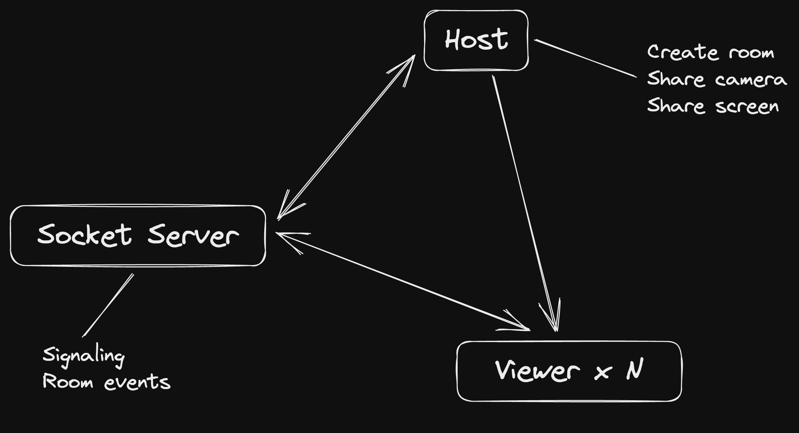

## STITCH

Bare prototype for real-time screen/camera sharing.
Simple implementation on WebRTC.

#### Architecture

#### Running

1. Run `npm install` on server and client directories
2. Run `npm run dev` on both directories

Default port
- server: 8000
- client: 3000

#### Caveats

Due to the complixity of WebRTC, this project is abandoned.

- Only runnable on the same local network (TURN server limitation)