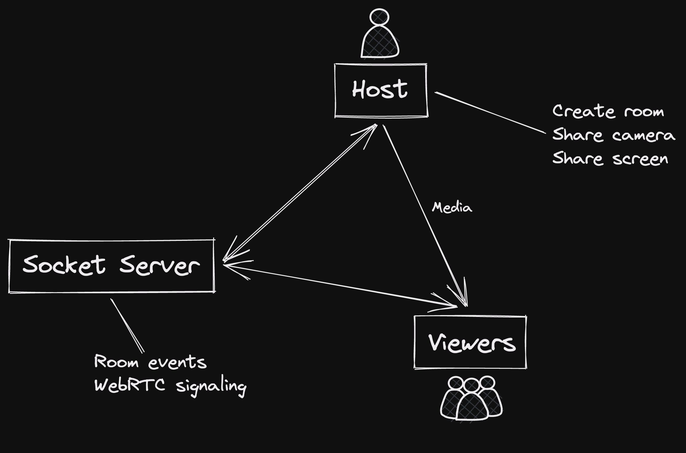

# STITCH

Bare prototype for real-time screen/camera sharing.\
Simple implementation on WebRTC.

## Architecture

## Running

### Development
- `find . -maxdepth 2 -name package.json -execdir npm i \;` for running `npm i` on both client and server
- `npm run dev:client` to start client on port 3000
- `npm run dev:start` to start server on port 8000

### Building
- `npm run build` to build both client and server
- `npm run start` to start both client and server on port 8000

## Caveats

- Only runnable on the same local network (TURN server limitation)